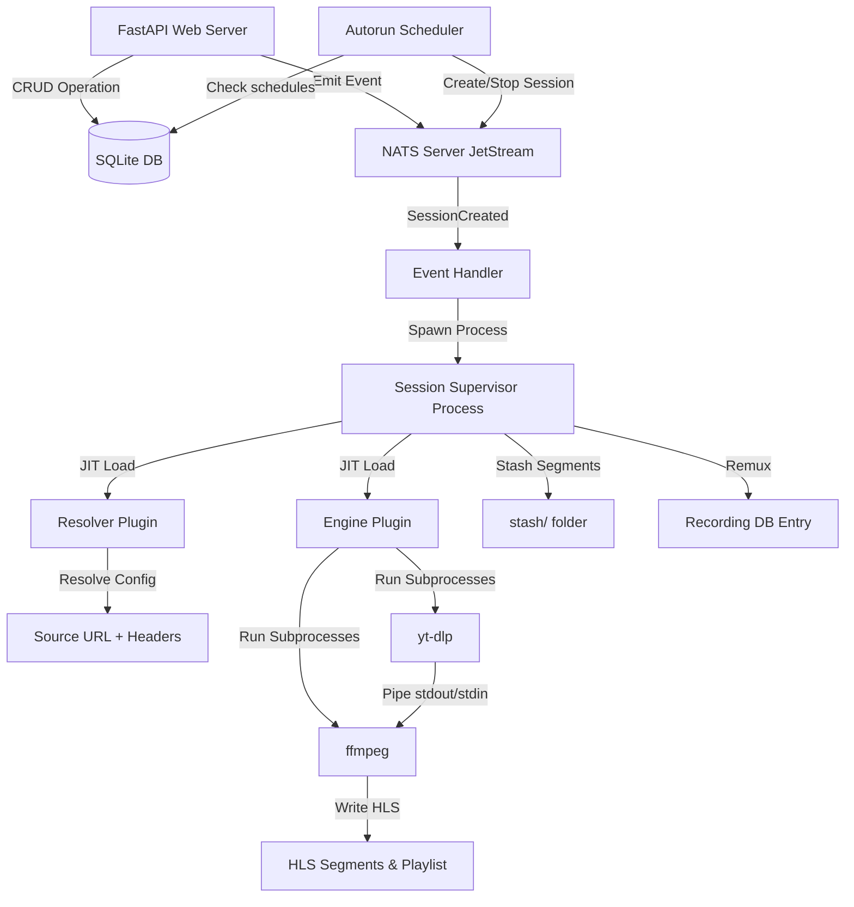

# Mirrorr Agent Context (`AGENTS.md`)

This file provides a highly optimized, high-precision context map of the **Mirrorr** codebase. It is designed to give LLM agents immediate, complete architectural understanding using minimal context window tokens.

---

## 0. Coding Style & Principles (READ FIRST)

**This is the most important section. All code written for Mirrorr MUST follow these principles.**

### Mandatory first step for new sessions
Before any coding, **read AGENTS.md in full** and confirm understanding. If it is stale or missing coverage for the task, report what is outdated or missing before proceeding. Do not assume — verify against the actual source files if anything is uncertain.

### Less is more
More code is often bad code. Elegant, compact code is preferred over verbose, ceremonial code. Every line must earn its place. If something can be inlined, inline it. If a class can be a function, make it a function. If a dataclass can be a plain dict, use a dict. Only introduce abstraction when it removes real complexity — not when it just makes things look more "designed".

### Reliability through condensation
The goal is to condense reliability into the least amount of classes and data structures possible. Each thing should have one concern and solve it well. The same semantical role split across many things is useless complexity. More complexity isn't bad, but less is more **when it doesn't remove value**.

### Batching concerns when it makes sense
If multiple things share the same lifecycle, the same connection, or the same output path — batch them together. Don't create separate classes, methods, or data structures for each if they can share infrastructure without losing clarity.

### Elegance over ceremony
Unnecessary docstrings, excessive error handling, and method-per-concern extraction are bad code. Code should be self-documenting through clear naming and minimal structure. Docstrings are good **only when they add information not obvious from the code itself**.

### Type safety, not type noise
Type hints are important. `TypeVar`, `ClassVar`, and other advanced typing constructs are used when they serve the code — not for decoration. If a type hint doesn't help the caller, don't add it.

### Compaction principle
> "more code is often bad code"

When refactoring, always check: does this change add lines that earn their place, or is it ceremony? Prefer removing lines over adding them. The best code change is one that reduces line count while preserving or improving behavior.

### No over-abstraction
Don't create context wrappers, shortcut methods, or intermediate dataclasses just because a "senior pattern" says so. If `context.bus.emit()` works, don't wrap it in `context.emit()`. If `bus` can be passed directly, don't wrap it in a context object.

### Line count reporting
After every editing session, report the number of lines added and removed across all changed files.

### Keep AGENTS.md up to date
After any meaningful edit to the codebase, update this file to reflect the changes. This includes:
- New or removed files in the directory structure
- New or changed features, models, events, or settings
- Updated status of implemented vs unimplemented features
- Any architectural changes that agents need to know about

AGENTS.md is the source of truth for agents working on this codebase. If it's stale, agents will make incorrect assumptions.

---

## 1. Project Essence & Direction
**Mirrorr** is a self-contained, event-driven live stream management service. It resolves stream configurations, downloads/records live streams using pluggable engines (`yt-dlp` piped to `ffmpeg`), generates live HLS playlists (`.m3u8` + `.ts` segments), and records high-frequency process telemetry.

**Long-term intent:** A self-hosted, API-driven live stream management backbone. Given stream sources (Twitch, YouTube, IPTV m3u, etc.), Mirrorr ingests them, transcodes/copies into HLS, optionally records to disk, and serves the segments over HTTP. Controlled entirely via REST API with WebSocket real-time event forwarding to a frontend.

**Current state:** The architecture and core pipeline (resolve → ingest → transcode → HLS) work. Autorun scheduling, recording lifecycle with stash/remux, and the autorun scheduler are implemented. HTTP file serving and CLI are not yet implemented.

---

## 2. Core Architecture & Lifecycle



1. **Boot** (`MirrorrCore._boot()`): Creates directories, copies default plugins if needed, initializes SQLite DB, locates FFmpeg, syncs plugins to DB, starts local NATS server, connects NATS client bus, starts autorun scheduler.
2. **API & Events**: FastAPI CRUD endpoints write to `data.db` and emit typed events (e.g., `SessionCreated`) over NATS.
3. **Process Isolation**: NATS handler intercepts `SessionCreated` and spawns an independent OS process (`multiprocessing.Process`) running `SessionSupervisor`.
4. **JIT Plugin Loading**: Supervisor dynamically loads Resolver and Engine plugins from the filesystem, verifying SHA-256 hashes against the database.
5. **Ingestion Pipeline**: Resolver resolves config → `Source` (URL + headers). Engine (e.g., `yt-dlp_piped`) runs `yt-dlp` piped to `ffmpeg`, writing HLS segments + `.m3u8` playlist to the session folder.
6. **Recording**: When recording is active, a background stash task copies the oldest 10% of segments to a `stash/` folder before ffmpeg deletes them. On session end, stash + remaining segments are concatenated via ffmpeg into an MP4, the session folder is moved to `recordings/`, and a `Recording` DB entry is created.
7. **Autorun Scheduler**: Polls every `autorun_check_interval` seconds. Creates sessions for autoruns whose `start_time` has arrived. Stops sessions linked to autoruns whose `end_time` has passed.
8. **Telemetry**: Supervisor captures subprocess stdout/stderr to log files and polls process resource usage (CPU, RAM, disk I/O) at 10Hz, forwarding to NATS for WebSocket clients.

---

## 3. Entry Points & Configuration

### Programmatic Usage (Primary)
```python
from src.core import MirrorrCore
from src.startup.config import MirrorrSettings

settings = MirrorrSettings(base_dir="./my_data")
core = MirrorrCore(settings)

# Any of these:
await core.run_async()          # async, blocks until shutdown
core.run_blocking()             # sync, calls asyncio.run internally
task = core.to_task()           # returns asyncio.Task[None]
```

### Environment File Usage
```python
settings = MirrorrSettings.create_from_env(".env")
core = MirrorrCore(settings)
core.run_blocking()
```

### `MirrorrSettings` (shipped with Mirrorr)
All paths default relative to `base_dir`. `MirrorrSettings.create_from_env()` reads env vars / .env file via `pydantic-settings`.

| Setting | Default | Purpose |
|---|---|---|
| `base_dir` | `.` | Root for all Mirrorr state |
| `content_dir` | `{base_dir}/content` | Video data + sessions |
| `autoruns_dir` | `{content_dir}/autoruns` | Scheduled session storage |
| `recordings_dir` | `{content_dir}/recordings` | Permanent recording storage |
| `engines_dir` | `{base_dir}/plugins/engines` | Engine plugin .py files |
| `resolvers_dir` | `{base_dir}/plugins/resolvers` | Resolver plugin .py files |
| `nats_server_dir` | `{base_dir}/nats-server` | Local NATS binary |
| `binaries_dir` | `{base_dir}/binaries` | Downloaded binaries |
| `db_file` | `{base_dir}/mirrorr_data.db` | SQLite database |
| `nats_port` | `4222` | NATS server port |
| `hls_window` | `60` | Sliding HLS manifest duration in seconds |
| `segment_duration` | `10` | Individual segment duration in seconds |
| `autorun_check_interval` | `10` | Seconds between autorun schedule checks |
| `use_system_ffmpeg` | `False` | Use $PATH ffmpeg |
| `use_system_nats` | `False` | Use $PATH nats-server |
| `api_host` | `localhost` | Uvicorn bind host |
| `api_port` | `8000` | Uvicorn bind port |

---

## 4. Domain Models
All models in `src/storage/models.py` using **SQLModel** (SQLAlchemy + Pydantic):

| Model | Purpose | Status |
|---|---|---|
| **Resolver** | Plugin that resolves config → `Source` (URL + headers) | Implemented |
| **Engine** | Plugin that consumes `Source`, runs subprocesses to write HLS. Has `retry_modes_schema` dict (JSON Schema per mode). | Implemented |
| **Profile** | Ties a Resolver + JSON config to a default Engine. Has `retry_mode`/`retry_config` as defaults for sessions using this profile. | Implemented |
| **Session** | Active/past stream operation. Links Profile + Engine. Has `recording`, optional `retry_mode`/`retry_config` overrides (None = inherit from profile), `retry_attempts`, and `session_urls`. | Implemented |
| **Autorun** | Scheduled session with `start_time`/`end_time`, `recording`, optional `retry_mode`/`retry_config` overrides, links Profile + Engine | Implemented |
| **Recording** | Denormalized snapshot of a completed recording (profile/engine/resolver names, path, metadata, `size_bytes`). | Implemented |
| **Source** | Pydantic model: `url` + optional `headers` dict | Used by Resolver → Engine handoff |
| **Capabilities** | Pydantic model: `can_record` / `can_playlist` | Used by Engine |
| **NoRetry / RetryAlways / RetryCount** | Retry mode schemas (Pydantic models). Defined in `models.py`, used by `EngineInterface.retry_modes` | Implemented |
| **`build_retry_modes_schema`** | Generates `{mode: {schema, default_params}}` dict for DB/API transport | Implemented |
| **`get_retry_delay` / `get_retry_max_attempts`** | Helpers that extract retry policy from mode+config | Implemented |
| **SessionStatus** | Enum: `ACTIVE`, `RECORDING`, `REMUXING`, `COMPLETED`, `FAILED` | Implemented |
| **ResourceType** | Enum: `SESSION`, `PROFILE`, `AUTORUN`, `RECORDING` | Implemented |
| **Client** | API client identified by hashed API key, linked to many Users | Implemented |
| **User** | Username + password auth with roles (`admin`/`user`), linked to many Clients | Implemented |
| **ClientUser** | Many-to-many join table: Client ↔ User | Implemented |
| **EventSubscription** | Tracks which user owns interest in which resource, for notification routing | Implemented |
| **Notification** | Notification toast for a user, triggered by major events (started, stopped, etc.) | Implemented |

---

## 5. Directory Structure
```
mirrorr-core/
├── main.py                      # Thin entry point: MirrorrSettings.create_from_env → MirrorrCore
├── src/
│   ├── core.py                  # MirrorrCore: boot, run_async, run_blocking, to_task, shutdown
│   ├── default_plugins/         # Bundled plugins shipped with the package
│   │   ├── engines/yt_dlp_piped.py      # yt-dlp → pipe → ffmpeg → HLS
│   │   └── resolvers/static.py          # Passthrough URL + headers from config
│   ├── api/                     # FastAPI web server
│   │   ├── api.py               # App init, exception handlers, router registration
│   │   ├── auth.py              # Auth infrastructure: password hashing, user/client resolution, subscription/notification helpers
│   │   ├── jwt.py               # JWT token creation and validation
│   │   ├── dependencies.py      # DB session DI, AuthState (client + user + is_admin), require_auth/require_admin
│   │   ├── ws.py                # WebSocket event mirroring + notification push
│   │   └── routers/
│   │       ├── auth.py          # Registration, login, user management, client management, notifications
│   │       ├── crud.py          # Dynamic CRUD router generator + session control endpoints
│   │       └── test.py          # Test endpoint for manual session creation
│   ├── event_bus/               # NATS-based event system
│   │   ├── event.py             # Event class definitions (Pydantic + NATS subjects)
│   │   ├── nats.py              # NatsRegistry: connect, emit, subscribe, on()
│   │   └── handlers/
│   │       ├── __init__.py      # Auto-imports all modules in this directory
│   │       └── handlers.py      # Process registry + lifecycle handlers + notification creation
│   ├── services/                # Process supervisors and background tasks
│   │   ├── managed_process.py   # Subprocess wrapper + event-driven lifecycle + telemetry
│   │   ├── process_bus.py       # In-process async event bus (pub/sub)
│   │   ├── session_supervisor.py# Per-session orchestrator (runs in own OS process)
│   │   ├── recording.py        # Segment stash + remux-to-MP4 lifecycle
│   │   └── autorun_scheduler.py # Background loop that starts/stops autorun sessions
│   ├── startup/                 # Boot sequence and environment checks
│   │   ├── config.py            # MirrorrSettings (Pydantic model + create_from_env)
│   │   ├── ensure_db.py         # Schema sync: create tables + add/remove columns
│   │   ├── ensure_engines.py    # Thin wrapper: engine-specific extractors for generic sync
│   │   ├── ensure_resolvers.py  # Thin wrapper: resolver-specific extractors for generic sync
│   │   ├── ensure_plugins.py    # Generic plugin sync: filesystem ↔ DB + JIT loader
│   │   ├── ensure_ffmpeg.py     # Locates/bundles FFmpeg binary
│   │   ├── ensure_nats_server.py# NatsServerManager: downloads/runs local NATS server
│   │   ├── api_bootstrap.py     # Uvicorn server startup
│   │   └── logging.py           # Loguru config with process-aware formatting
│   └── storage/                 # Database layer
│       ├── database.py          # create_db_engine(settings) → (engine, session_factory)
│       ├── models.py            # SQLModel schemas + ABC interfaces for plugins
│       └── crud.py              # Generic async CRUD helpers
├── js.conf                      # NATS JetStream configuration
└── data.db                      # (legacy, see db_file setting)
```

---

## 6. Coding Conventions & Style Rules

### Python Style
- **Python 3.14+** (uses `type | None` union syntax, not `Optional[]`).
- **`loguru`** for all logging. Never use `print()`. Use `logger.info()`, `logger.error()`, `logger.success()`, etc.
- **`loguru` color shortcuts**: Use `logger.opt(colors=True)` with `<green>`, `<yellow>`, `<blue>` tags for highlighted values.
- **Type hints** are expected on function signatures and class attributes. Use modern syntax (`list[str]`, `dict[str, Any]`, `str | None`).
- **`async/await`** throughout. The entire DB layer, API, NATS client, and event handlers are async.

### Architecture Patterns
- **Plugins are interfaces**: Engines implement `EngineInterface`, Resolvers implement `ResolverInterface`. Both are ABCs. Default plugins live in `src/default_plugins/`; user plugins are copied to `{engines_dir}` / `{resolvers_dir}` at boot.
- **Plugins are stateless**: They are loaded JIT via `importlib`, instantiated, used, and discarded. No persistent state in plugins.
- **Plugins are hash-verified**: `ensure_plugins.py` provides a generic `sync_plugins_db()` that `ensure_engines.py` and `ensure_resolvers.py` call with plugin-specific extractors. JIT loaders verify hashes before execution.
- **Plugins declare schemas for their config**: Resolvers expose `config_model → model_json_schema()`. Engines expose `retry_modes → dict[str, type[BaseModel]]` → serialized via `build_retry_modes_schema()`. Both are stored as JSON columns on their DB rows.
- **Retry modes are engine-driven**: Each engine inherits a default `{none, always, count}` retry set via `EngineInterface.retry_modes`. Engines can override this property to customize available modes. The supervisor reads `Session.effective_retry_mode()` + `Session.effective_retry_config()` (session override → profile default → hardcoded default) and loops `_run_attempt()` until success, stop, or exhaustion.
- **Events are typed Pydantic models**: Each event is a class with a `ClassVar[str]` subject. Register handlers with `@bus.on(MirrorrEvent.EVENT_NAME)`.
- **Long-running work happens in separate OS processes**: The event handler for `SessionCreated` spawns `multiprocessing.Process`. The supervisor must be fully self-contained.
- **DB schema auto-syncs**: Add/remove columns in SQLModel classes and `ensure_db.py` handles ALTER TABLE at startup. No manual migrations.
- **All dependencies are passed, never global**: `MirrorrSettings` is passed to every subsystem. No module-level singletons for settings, DB engine, or session factory. The only singleton is the NATS event bus (`bus`).
- **Event mapping lives in the CRUD router**: `event_map` dict maps model classes to their `(created, updated, deleted)` event tuples. Domain models do NOT carry event references.
- **Supervisor-owned fields are protected**: `PUT /sessions/{id}` strips `status`, `recording`, `retry_attempts`, `started_at`, `ended_at`. Clients must use dedicated control endpoints.

### Import Conventions
- Settings: `MirrorrSettings` passed via constructor. No module-level import of a settings singleton.
- Database: `from src.storage.database import create_db_engine` → called with settings, returns `(engine, session_factory)`.
- Models: `from src.storage.models import Session, Profile, ...`
- Events: `from src.event_bus.nats import bus` and `from src.event_bus.event import MirrorrEvent`.
- CRUD: `from src.storage.crud import get_all, get_by_id, create, update, delete`

### File Organization
- **`src/`** contains all core application code (API, event bus, services, storage, startup, core).
- **`src/default_plugins/`** contains bundled plugins shipped with the package.
- **User plugin dirs** (`plugins/engines/`, `plugins/resolvers/`) are created at runtime relative to `base_dir`.
| `www/` | (removed, now served via `dev_serve_files` flag in config) |
- **`binaries/`** is for downloaded NATS server and FFmpeg binaries (gitignored).

---

## 7. Known Issues & WIP Gaps

### Not Yet Implemented
- **CLI interface**: Project description implies CLI tool, but no CLI entry points exist yet.

### Structural Concerns


---

## 8. Key File Quick Reference

| File | What it does |
|---|---|
| `main.py` | Thin entry point. Creates `MirrorrSettings` from .env, boots `MirrorrCore`. |
| `src/core.py` | `MirrorrCore` class: boot, run_async, run_blocking, to_task, shutdown. **Main API surface.** |
| `src/startup/config.py` | `MirrorrSettings` (Pydantic model) + `create_from_env()` factory. Includes `web_url`, `dev_serve_files`, `nats_url`. |
| `src/storage/models.py` | All domain models + `EngineInterface`/`ResolverInterface` ABCs. |
| `src/storage/database.py` | `create_db_engine(settings)` → `(engine, session_factory)`. |
| `src/event_bus/nats.py` | `NatsRegistry` singleton (`bus`): connect, emit, on(), start_subscriptions(). |
| `src/event_bus/event.py` | Event class definitions. Each has a NATS subject string. |
| `src/event_bus/handlers/handlers.py` | Process registry + lifecycle handlers: spawns/kills supervisors, handles autorun deletion. Creates notifications for major events. |
| `src/services/session_supervisor.py` | Per-session orchestrator. Loads plugins JIT, resolves source, starts engine, manages retries. Composes `RecordingManager` for stash/remux. Builds `session_urls` for static files + HLS playlist. |
| `src/services/recording.py` | `RecordingManager` dataclass: segment stash during streaming, remux-to-MP4 on finalize, Recording DB entry creation. Composed into `SessionSupervisor`. |
| `src/services/autorun_scheduler.py` | Background loop: creates sessions for due autoruns, stops sessions when autorun end_time passes (via NATS request/reply with feedback). |
| `src/services/managed_process.py` | Subprocess wrapper with event-driven lifecycle, telemetry polling, log capture. |
| `src/services/process_bus.py` | In-process async pub/sub bus. Topic-based message passing via `asyncio.Queue`. |
| `src/startup/ensure_plugins.py` | Generic plugin sync: `load_plugin_jit()` + `sync_plugins_db()` with extractors. |
| `src/startup/ensure_engines.py` | Thin wrapper: `load_engine_jit()` + `sync_engines_db()` with engine-specific field extractors. |
| `src/startup/ensure_resolvers.py` | Thin wrapper: `load_resolver_jit()` + `sync_resolvers_db()` with resolver-specific field extractors. |
| `src/startup/ensure_db.py` | `ensure_db(engine)` — schema auto-migration (add/remove columns). |
| `src/startup/ensure_nats_server.py` | `NatsServerManager(settings)` — downloads/runs local NATS server binary. |
| `src/api/routers/crud.py` | CRUD router with protected fields + ownership-based access control + session control endpoints (stop, recording enable/disable via NATS request/reply). Orphan cleanup on 504. Subscriptions auto-created on resource creation. |
| `src/api/auth.py` | Auth infrastructure: password hashing (`bcrypt`), API key hashing, client/user resolution, subscription/notification helpers. |
| `src/api/jwt.py` | JWT token creation (`create_access_token`) and validation (`decode_access_token`) using HS256. |
| `src/api/routers/auth.py` | Registration, login (`/auth/register`, `/auth/login`), `/auth/me`, password change, admin user/client management, notifications. |
| `src/api/dependencies.py` | DB session DI, `AuthState` (client, user, is_admin), `require_auth`/`require_admin`/`get_auth`/`ws_auth` dependencies. |
| `src/api/ws.py` | WebSocket event mirroring (user-filtered via JWT/API key) + real-time notification push (`/ws/notifications`). |
| `src/default_plugins/engines/yt_dlp_piped.py` | Example engine: `yt-dlp` piped to `ffmpeg` → HLS output. |
| `src/default_plugins/resolvers/static.py` | Example resolver: passthrough URL + headers from config. |
